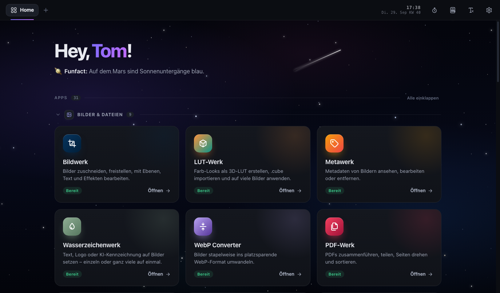

# 🧰 Toms Tools

**32 kleine Werkzeuge in einer einzigen HTML-Datei – offline, ohne Installation, ohne Cloud.**

  
  
   
  Download lädt immer die neueste Version · Live ist zum Reinschnuppern – für den Alltag lieber herunterladen

🆕 <b>Neu in 1.7:</b> Screenshotwerk · PDF-Werk mit Seitenzahlen, Stempel &amp; Verkleinern · erste Apps auf Englisch · Neon-Arena mit Maus – <a href="https://github.com/tj537/toms-tools/releases/tag/v1.7.0">alle Neuerungen</a>

Doppelklick, und es läuft – alles im Browser, alles auf deinem Rechner. **[👉 Alle 32 Apps ansehen](#apps)**

> 🇬🇧 **English:** 32 offline tools in one single HTML file – image editing, screenshots, watermarks & AI labels, PDFs, text comparison, invoices, business models, charts, calculators, a source manager, flashcards and more. No install, no admin rights, no account: everything runs locally in your browser. Made by a beginner in marketing and web development, together with Claude Opus 5.5. The interface is mostly German – English is coming app by app (already in English: home page, top bar, settings, Bildwerk, Screenshotwerk, LUT-Werk, Metawerk, Wasserzeichenwerk, WebP Converter, PDF-Werk, Bildbenamung, Bulk Rename, Sortierwerk, Farbwerk, QR-Werk, Shaderwerk, Vergleichswerk, Notizen, Todo, Timer, Pitcher, Laberwerk, Codewerk, Diagrammwerk and Karteiwerk – pick English right at the first start or later at the top of the settings). Feedback welcome!

---

## 👋 Hi!

Ich bin Tom. Auf der Arbeit und im Studium brauche ich ständig kleine Werkzeuge – vor allem rund um Marketing, BWL, Bilder, Texte, Daten und Code. Also habe ich sie mir selbst gebaut, zusammen mit [Claude Opus 5.5](https://claude.ai), und stelle sie hier öffentlich. Vielleicht helfen sie ja auch dir.

Toms Tools ist mein erstes größeres Projekt – Feedback ist jederzeit willkommen!

- 🚧 **Work in Progress.** Es kommt laufend Neues dazu – und nach und nach auch mehr auf Englisch.
- 💻 **Für den Desktop gemacht.** Toms Tools ist für Chrome, Edge & Co. am Computer gedacht. Auf Handy und Tablet ist die Darstellung nicht überall geprüft, und Funktionen wie Ordnerzugriff oder Drag & Drop brauchen einen Desktop-Browser.
- 🐛 **Bestimmt sind noch Fehler drin.** Bei Apps, die Dateien umbenennen oder verschieben (Bulk Rename, Sortierwerk), erst mit einer Kopie testen.
- 💬 **Sag mir, was du denkst.** Ob Bug, Idee oder „das geht besser so“: einfach ein [Issue](../../issues) aufmachen.

## ✨ Das Besondere

- **Eine Datei.** Keine Installation, keine Admin-Rechte, kein Konto. Die Datei kann auf einem USB-Stick liegen oder im OneDrive – perfekt für den Arbeits-PC.
- **Wirklich lokal.** Eine Content-Security-Policy sperrt die Seite komplett vom Netz aus: Sie *kann* gar nichts hochladen oder nachladen. Kein Tracking, keine Werbung, keine Server. Zwei kleine Ausnahmen gibt es – beide unten in den Einstellungen und nur auf Klick: den freiwilligen Kaffee-Knopf (PayPal) und einen Link zu dieser GitHub-Seite.
- **Schnell.** Alles läuft direkt im Browser, Grafik-Lastiges auf der Grafikkarte (WebGL2).
- **Deine Daten gehören dir.** Gespeichert wird im Browser – mit Backup-Export und automatischer Sicherung in einen Ordner deiner Wahl.

## 🧩 Die Apps

Dazu immer griffbereit in der oberen Leiste: **Pomodoro-Timer**, **Taschenrechner** und **Formatierung entfernen** – Text z. B. aus Word kopieren, auf den Knopf klicken, Strg + V drücken (Mac: ⌘ + V): Schon liegt er als reiner Text in der Zwischenablage, ohne Schrift, Farben und Word-Ballast.

### 🖼️ Bilder & Dateien · 10 Apps

- **Bildwerk** – Bilder zuschneiden, skalieren und freistellen: Hintergrund per Klick entfernen, mit Zauberstab und Maske nachbessern. Dazu Ebenen (z. B. ein Logo auf jedes Bild), Pinsel, Text und Farbkorrektur. Export als PNG, JPG oder WebP – auch viele Bilder nacheinander.
- **Screenshotwerk** – Bildschirm aufnehmen (mit Selbstauslöser) oder mit Strg + V einfügen, dann mit Pfeilen, Rahmen, Text, nummerierten Schritten und Textmarker markieren und Namen & Daten verpixeln. Zum Schluss schick gemacht mit Hintergrund und Browserrahmen kopieren oder speichern.
- **LUT-Werk** – Eigene Farb-Looks als 3D-LUT bauen oder `.cube`-Dateien importieren und auf viele Bilder auf einmal anwenden. Looks lassen sich als `.cube` exportieren, z. B. für Videoschnitt-Programme.
- **Metawerk** – Versteckte Bild-Infos (EXIF & IPTC) wie Kamera, Aufnahmedatum oder Urheber ansehen, bearbeiten oder vor dem Teilen entfernen.
- **Wasserzeichenwerk** – Text, Logo oder **KI-Label** auf Bilder setzen – einzeln oder ganz viele auf einmal (ZIP oder Ordner). Das KI-Label kann zusätzlich maschinenlesbar in die Datei geschrieben werden (IPTC) – das hilft bei der Kennzeichnung im Sinne des EU AI Act. Welche Pflichten für dich gelten, hängt davon ab, wie du KI nutzt; keine Rechtsberatung.
- **WebP Converter** – Bilder stapelweise ins platzsparende WebP-Format umwandeln, mit Qualitätsregler und auf Wunsch web-tauglichen Dateinamen (klein, ohne Leerzeichen). Als ZIP oder direkt in einen Ordner.
- **PDF-Werk** – PDFs und Bilder zusammenführen, teilen und per Drag & Drop sortieren, Seiten drehen, duplizieren oder löschen. Für den Büroalltag: Seitenzahlen, Stempel (z. B. ENTWURF oder VERTRAULICH), Verkleinern für E-Mail-Anhänge, Graustufen, Formulare fixieren, einseitig gescannte Vorder- und Rückseiten mischen und Seiten als JPG/PNG speichern.
- **Bildbenamung** – Bildnamen aus Bausteinen (z. B. Produkt, Farbe, Ansicht) zusammenklicken und die Dateien direkt umbenennen – praktisch für Produktfotos.
- **Bulk Rename** – Viele Dateien auf einmal umbenennen – mit Regeln wie Suchen & Ersetzen (auch Regex), Nummerieren oder Groß-/Kleinschreibung. Du siehst vorher jede Änderung und kannst sie rückgängig machen.
- **Sortierwerk** – Einen Fotoordner automatisch in Unterordner sortieren – nach Aufnahmedatum, Kamera, Ausrichtung oder Dateityp. Begleitdateien wie `.xmp` und `.aae` wandern mit.

### 🎨 Design & Grafik · 3 Apps

- **Farbwerk** – Farbpaletten zusammenstellen, Farben aus dem Bildschirm aufnehmen und Farbcodes (HEX, RGB & Co.) per Klick kopieren.
- **QR-Werk** – QR-Codes für Links, WLAN und Kontakte erstellen, farbig gestalten und als PNG oder SVG speichern.
- **Shaderwerk** – Fraktale und generative Kunst in Echtzeit auf der Grafikkarte – über 30 Vorlagen, eigener Code, Musik-Modus und Video-Export. Schön als Hintergrund oder einfach zum Staunen.

### ✍️ Text, Präsentation & Sprache · 6 Apps

- **Textwerk** – Textstatistik & Lesbarkeit, Suchen & Ersetzen, Teleprompter, Blindtext und sichere Passwörter.
- **Vergleichswerk** – Zwei Textversionen vergleichen: Änderungen werden Wort für Wort (oder Zeichen / Zeile) farbig markiert, mit Statistik und Sprung von Änderung zu Änderung.
- **Codewerk** – Kleine Helfer für Code und Daten: JSON formatieren, Regex testen, Base64, URL, Hashes, UUIDs, Zeitstempel, Zahlensysteme und JWT.
- **Spickzettel** – Sonderzeichen, Emojis, Snippets und Vorlagen, Git- und Terminal-Befehle, Shortcuts für Windows & Mac und ein Linux-Cheatsheet mit Erklärungen – ein Klick kopiert.
- **Pitcher** – Markdown schreiben und als Präsentation im Vollbild zeigen.
- **Laberwerk** – Texte mit den Stimmen deines Systems vorlesen lassen, mit einstellbarem Tempo – auf Wunsch nur mit Offline-Stimmen.

### 🗂️ Organisation & Planung · 5 Apps

- **Notizen** – Bunte Notizkarten mit Checklisten und ein Notizblock mit Tabs.
- **Todo** – Aufgaben mit Projekten, Prioritäten und Fristen – als Liste oder Kanban-Board.
- **Gedankenwerk** – Mindmaps bauen, gestalten und als Bild oder Text exportieren.
- **Timer** – Großer Countdown im Vollbild mit Warnfarben und Signalton – z. B. für Präsentationen oder Prüfungen.
- **Rechnungswerk** – Saubere Rechnungen mit Logo, MwSt. und GiroCode als PDF. Dazu Geschäftsbriefe.

### 📊 Business & Lernen · 5 Apps

- **Modellwerk** – 15 Vorlagen mit Leitfragen – von SWOT, Business Model Canvas und Persona bis Pro & Contra, Eisenhower-Matrix und SMART-Ziel. Export als Text, PNG oder PDF.
- **Kennzahlwerk** – 20 Rechner mit Formel und Rechenweg – Prozente, Netto/Brutto, Zinseszins, Notenschnitt, ROI, CLV, Break-even, Nutzwertanalyse, Preiskalkulation (Handel), Zuschlagskalkulation, Betriebsergebnis und mehr.
- **Diagrammwerk** – Säulen-, Balken-, Linien- und Kreisdiagramme und Zeitpläne (z. B. Mo–Di Recherche, Di–Do Konzept). Daten aus Excel einfügen, als PNG oder SVG exportieren oder direkt in Word/PowerPoint kopieren.
- **Quellenwerk** – Bücher, Artikel und Links mit Notizen und Zitaten sammeln – Beleg mit „vgl.“ und Literaturverzeichnis per Klick kopieren (deutsch oder APA 7).
- **Karteiwerk** – Karteikarten für jedes Thema mit Karteikasten-Prinzip: Du übst vor allem, was noch nicht sitzt. Import und Export für Anki und Quizlet, Lernserie 🔥.

### 🎲 Spaß & Musik · 3 Apps

- **Entscheidungshilfe** – Glücksrad, Münzwurf oder Orakel – lass den Zufall entscheiden.
- **Spielwiese** – Kleine Spiele für zwischendurch: Neon-Arena (Twin-Stick-Shooter mit Maus oder Pfeiltasten, Bossen und Power-ups), Tipptrainer, Ausweichen, Reaktionstest und Perfekter Kreis.
- **Beatwerk** – Drums, Bass und Melodie im Step-Sequencer – mit Genre-Vorlagen, Zufalls-Beats per Würfel und WAV-Export.

## 🎛️ So wie du's brauchst

Du brauchst nicht alle 32 Apps? Kein Problem:

- **Apps ausblenden:** Unter *Einstellungen → Apps* schaltest du jede App einzeln an oder aus. Ausgeblendete Apps verschwinden von der Startseite – übrig bleibt dein persönlicher Werkzeugkasten. Deine Daten bleiben dabei erhalten. Oben neben „Apps“ siehst du, wie viele gerade aktiv sind (z. B. „24 / 32“).
- **Gruppen einklappen:** Auf der Startseite lassen sich die Gruppen (z. B. „Bilder & Dateien“) mit einem Klick zu- und aufklappen.
- **Dein Name:** Die Startseite begrüßt dich persönlich. Den Namen trägst du unter *Einstellungen → Start* ein – und kannst ihn dort jederzeit ändern.
- **Maskottchen:** Auf der Startseite schwebt ein kleiner Roboter mit Raketenantrieb – und macht ein Nickerchen, wenn du eine Weile nichts tust. Unter *Einstellungen → Maskottchen* stellst du seine Größe ein oder blendest ihn aus.
- **Aussehen:** Farbthema, Akzentfarbe, eigenes Hintergrundbild oder Weltall, Funfacts in der Begrüßung und ob beim Start die letzte Sitzung wieder aufgeht – alles unter *Einstellungen*.

## 🚀 Loslegen

1. **[`toms-tools.html` herunterladen](https://github.com/tj537/toms-tools/releases/latest/download/toms-tools.html)** – oder über den Download-Knopf ganz oben.
2. **Doppelklick** auf die Datei – sie öffnet sich im Browser.
3. Fertig. Tipp: Als Lesezeichen speichern oder an die Taskleiste anheften.

**Live ausprobieren:** Ohne Download geht es auch direkt unter **[tj537.github.io/toms-tools](https://tj537.github.io/toms-tools/)** – ideal zum Reinschnuppern. Was der Unterschied zum Download ist, steht [gleich hier drunter](#live).

**Browser:** Toms Tools ist für den **Desktop** gemacht – am besten **Chrome, Edge, Brave oder Opera**. Auf Handy und Tablet ist die Darstellung nicht überall geprüft. Firefox und Safari gehen für die meisten Apps auch – nur die Funktionen mit direktem Ordnerzugriff (Bulk Rename, Sortierwerk, Ordner-Sicherung) und die Pipette brauchen einen Chromium-Browser.

## 🌐 Download oder live?

Beides ist dieselbe App. Für den Alltag empfehle ich trotzdem den Download – das hier ist der Unterschied:

| | ⬇️ Download | ▶️ Live im Browser |
|---|---|---|
| **Stand** | fester, getesteter Release | immer der allerneueste Stand – auch Dinge, die noch in Arbeit sind |
| **Internet** | läuft komplett offline | braucht zum Laden eine Verbindung; in manchen Firmennetzen ist `github.io` gesperrt |
| **Deine Daten** | liegen im Browser auf deinem Rechner | hängen an der Webadresse – Browser dürfen sie bei längerer Nichtnutzung aufräumen (Safari z. B. nach 7 Tagen) |
| **Updates** | neue Version einfach herunterladen | kommen automatisch |

Die Daten der beiden Varianten sind getrennt. Mit *Einstellungen → Speicher & Sicherung → Backup exportieren / importieren* ziehst du sie jederzeit von der einen zur anderen um.

## 💾 Deine Daten & Speichern (Local Storage)

- **Alles speichert sich automatisch** – sobald du tippst, klickst oder eine Karteikarte beantwortest. Einen Speichern-Knopf gibt es nicht, und du brauchst ihn auch nicht.
- Die Daten liegen **nur im Local Storage deines Browsers auf deinem Rechner** (pro Browser). Nichts wird an einen Server geschickt.
- **Ordner-Sicherung (empfohlen):** Unter *Einstellungen → Speicher & Sicherung* einen Ordner wählen, z. B. in OneDrive. Toms Tools sichert dann automatisch in die Datei `toms-tools-daten.json` – gesammelt, sobald du kurz innehältst, also nicht bei jedem Tastendruck. Dazu kommt pro Tag eine Kopie im Unterordner `sicherungen`; ältere als 14 Tage werden automatisch gelöscht, der Ordner bleibt also übersichtlich. Geht in Chrome, Edge und Brave.
- **Zweiter PC:** Dort denselben Ordner wählen und *Aus Ordner laden* – schon sind Notizen, Karteikarten, Quellen & Co. auch da.
- **Backup exportieren / importieren:** Alles als eine Datei zum Mitnehmen – funktioniert in jedem Browser.
- **Speicherplatz:** Der Browser gibt Toms Tools rund 5 MB. Wie viel jede App davon belegt, siehst du ebenfalls unter *Speicher & Sicherung*.
- ⚠️ Wer die Browserdaten löscht, löscht auch die Toms-Tools-Daten. Also: Ordner-Sicherung einschalten.

## 🔒 Datenschutz & Sicherheit

- Die Seite bringt eine strenge **Content-Security-Policy** mit (`default-src 'none'`, Verbindungen nur zu `data:`/`blob:`). Der Browser verhindert damit jede Verbindung ins Internet – auch versehentliche.
- Es gibt **keine Analyse, keine Cookies von Dritten, keine externen Schriften oder Skripte**.
- Passwörter, Hashes und JWTs aus Textwerk/Codewerk werden **nie gespeichert**.
- Links nach draußen öffnen sich nur, wenn du sie anklickst – jeweils in einem neuen Tab: der freiwillige Kaffee-Knopf (PayPal) und der Link zu dieser GitHub-Seite, beide in den Einstellungen, sowie die Links, die du selbst im Quellenwerk speicherst.

## 🛠️ Unter der Haube

- Reines **HTML, CSS und JavaScript** – kein Framework, keine Abhängigkeiten, kein Build.
- Etwa 3,5 MB groß, davon rund 2 MB für die eingebetteten PDF-Bibliotheken (werden erst beim Öffnen von PDF-Werk geladen).
- **WebGL2** für Shaderwerk und LUT-Werk, **File System Access API** für die Ordner-Funktionen.

## 💬 Feedback

Fehler gefunden, eine Idee für ein neues Werkzeug oder Kritik am Code? Einfach ein [Issue](../../issues) aufmachen. Ich freue mich über jede Rückmeldung, auch über ehrliche.

## 📄 Lizenz

Toms Tools steht unter der **[MIT-Lizenz](LICENSE)** – du darfst es frei nutzen, verändern und weitergeben, solange der Lizenzhinweis erhalten bleibt.

Eingebettete Fremdbibliotheken behalten ihre eigenen Lizenzen:

- [pdf-lib](https://pdf-lib.js.org) 1.17.1 – MIT (enthält tslib, © Microsoft, Apache 2.0)
- [pdf.js](https://mozilla.github.io/pdf.js/) 3.11.174 – Apache 2.0, © Mozilla Foundation
- Der QR-Kodierer folgt dem [QR Code generator](https://www.nayuki.io/page/qr-code-generator-library) von Project Nayuki – MIT

---

made with ♥ by Tom &amp; Claude · work in progress

